# ListofDevelopers
My Andela Intermediate Project
This project is for the Andela Android Learning Community(ALC) intermediate level challenge. The requirements are;
- Build an Android app to retrieve a list of Java Developers in Lagos using the Github API 
- Display the list of developers on a list. Each item on the list should have:
1. User’s profile image
2. User’s GitHub username
3. Clicking each item on the list should show their profile details.
4. The profile screen should contain:
-Username
-Profile photo
-Github profile URL
-Button to share their profile, and it should launch a share intent and the content of the share should be “Check out this awesome developer @<github username>, <github profile url>.”
-Clicking on the Github url should launch the browser and link to their Github page.

<a href="http://www.youtube.com/watch?feature=player_embedded&v=BpClgO01pgQ
" target="_blank">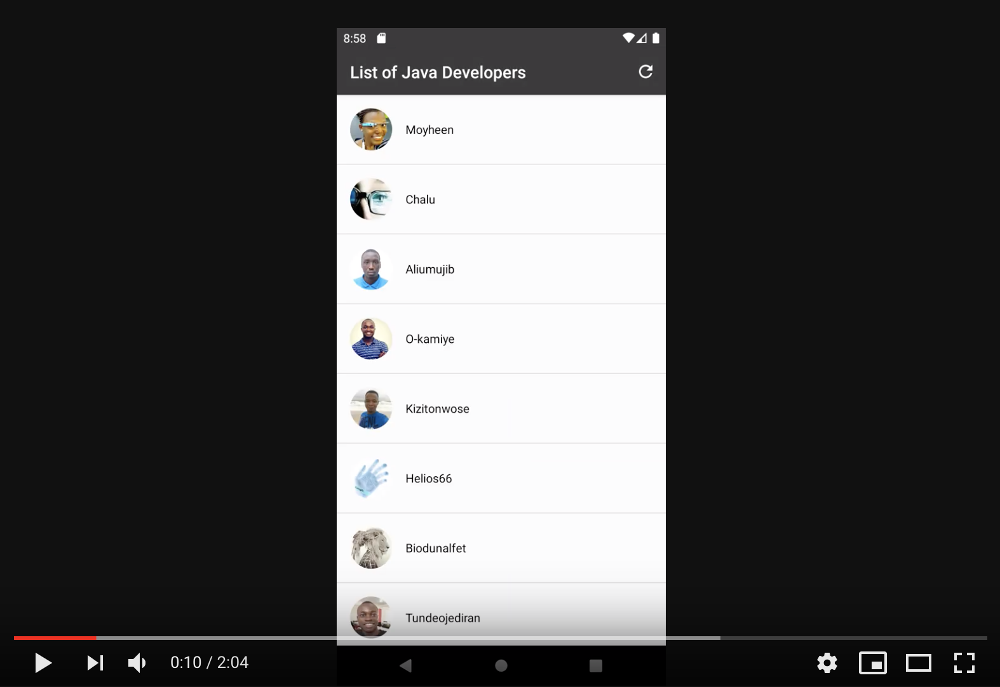</a>

  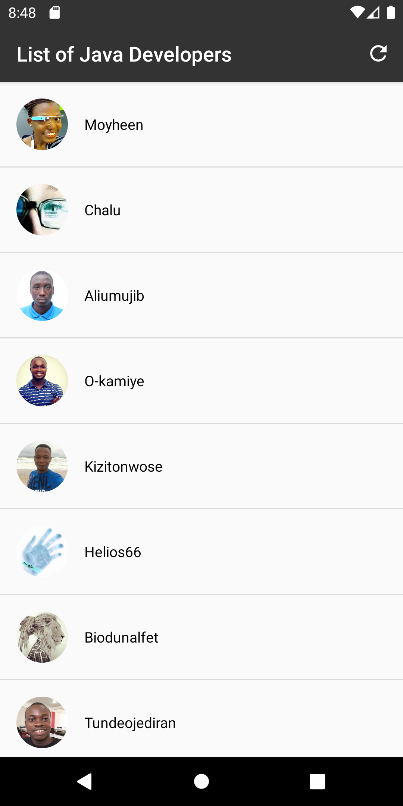
  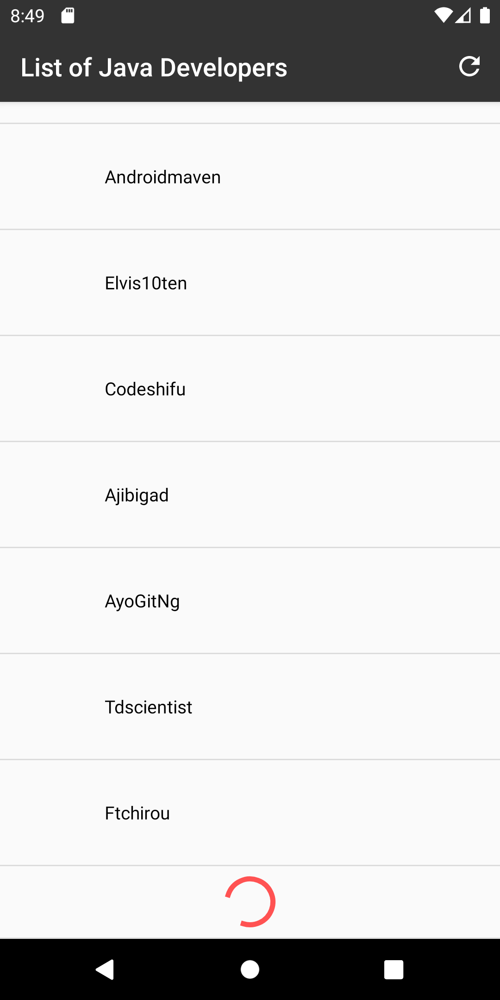
  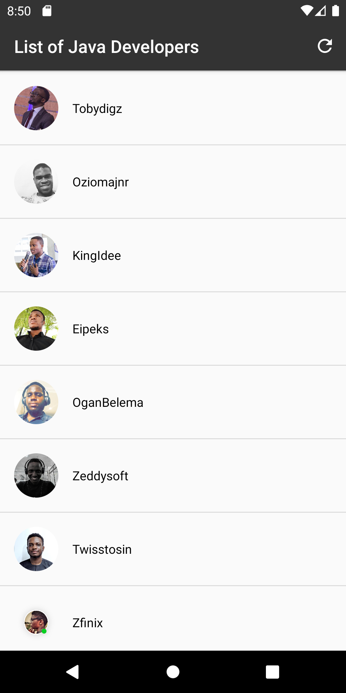
  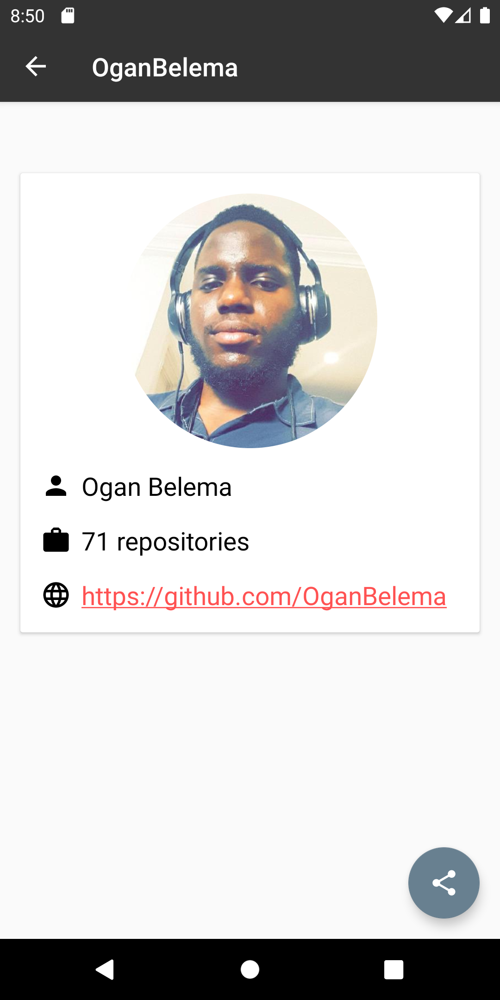
  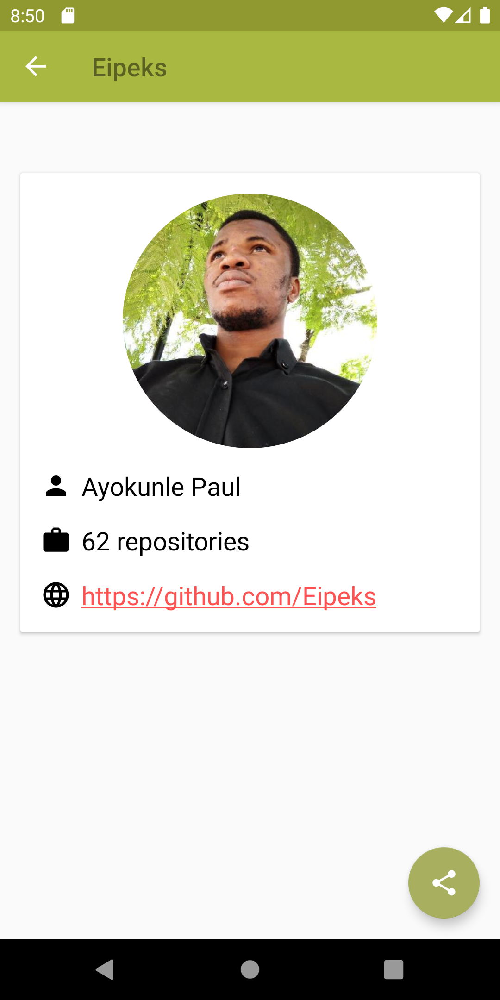
  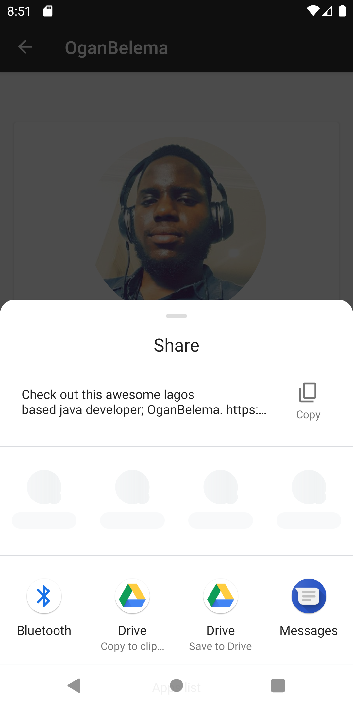
  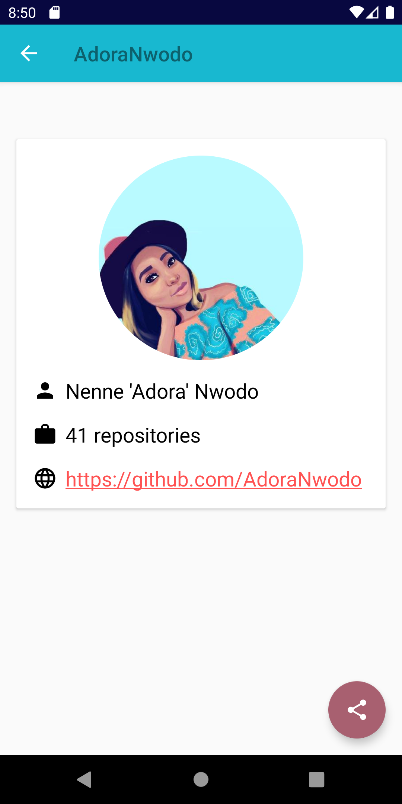
  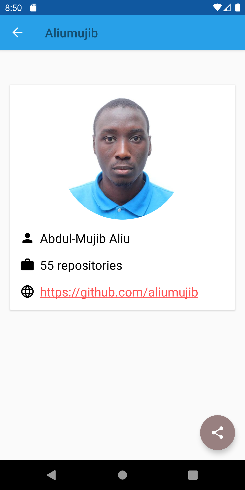
  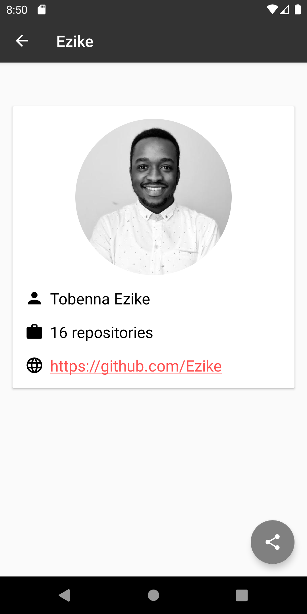
  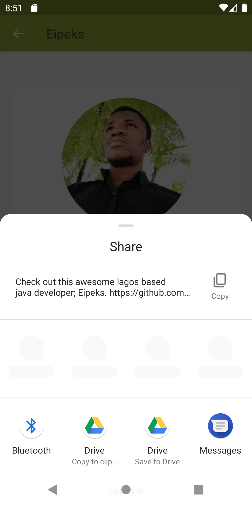

